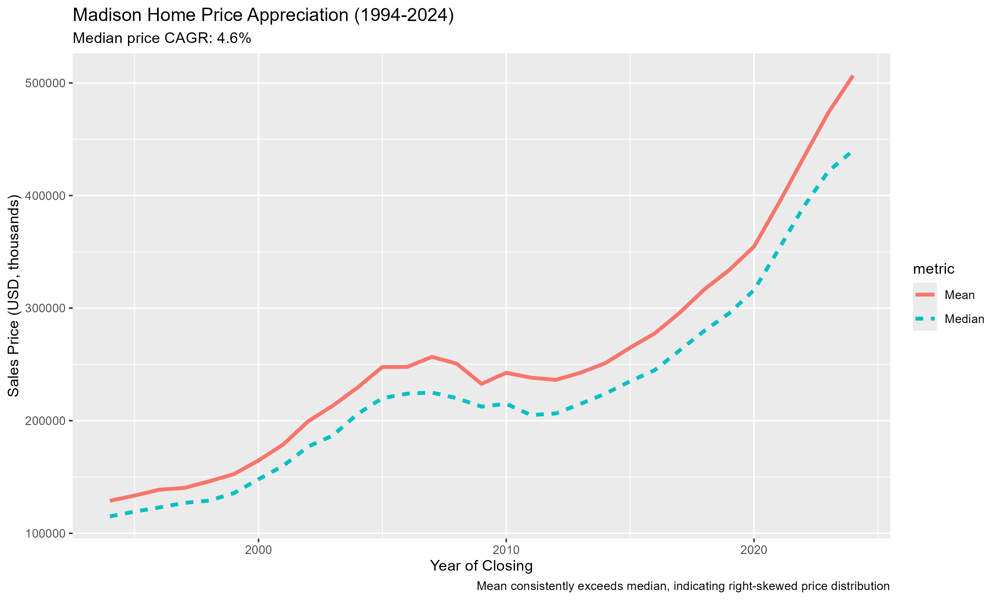

## Madison Housing Analysis — Report 1: City of Madison (1994–2024)

This report analyzes 68,000+ single-family home sales within the City of Madison,
Wisconsin from 1994 through 2024. It establishes the baseline price trends, market
volume patterns, and structural characteristics of the Madison housing market over
three decades.

Median prices rose from roughly $100,000 in 1994 to over $400,000 by 2024 — a
compounded annual growth rate of approximately 4.6%.

---

### Key Findings

**Steady long-term appreciation with a right-skewed distribution**
Median prices rose fourfold over the study period. The mean consistently exceeded
the median throughout, reflecting a right-skewed price distribution — a small number
of high-value sales pull the mean upward each year.

**Price per square foot more than tripled**
Price intensity accelerated after 2010, consistent with supply constraints in a
growing university city. This measure captures market pressure independent of
changes in home size.

**Market volume fluctuated but remained active**
Annual sales ranged from approximately 1,850 to over 2,700 transactions. The
post-2021 softening aligns with affordability pressure from rising mortgage rates,
though prices have remained elevated.

**Homes grew larger over time**
Median finished square footage increased by approximately 400 square feet over
30 years, reflecting both new construction trends and shifts in buyer preferences.

**Bedroom composition remained stable**
Three-bedroom homes consistently represented 45–50% of all transactions throughout
the study period, indicating a stable underlying demand structure.

---

### Median vs. Mean Price by Year (1994–2024)

Despite the volume slowdown post-2021, prices remain elevated relative to long-run
trends. The persistent gap between mean and median reflects ongoing right skew
in the price distribution.

---

### Report Files

- [PDF Report](proj1_mad_city_hist.pdf)
- [R Markdown Source](proj1_mad_city_hist.Rmd)

See also: [Report 2 — Madison Area including Suburbs](/madison-area-report2/)

[Back to Home](/)
