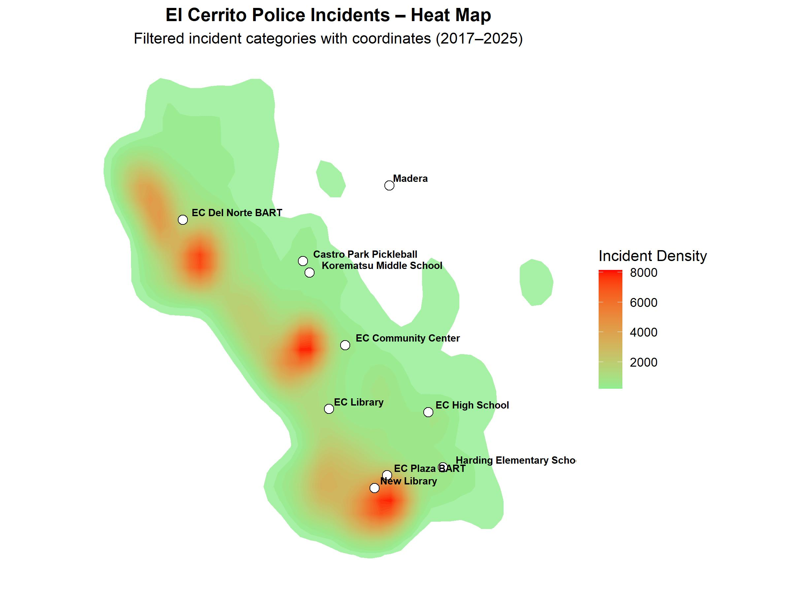

## El Cerrito Police Incident Analysis (2019–2025)

This report analyzes police incident records for El Cerrito, California from 2019
through March 2025. The dataset covers incident counts by type, geography, and time,
with particular attention to spatial concentration and year-over-year trends.

---

### Key Findings

**High concentration along San Pablo Avenue**
Incidents are heavily concentrated along San Pablo Avenue, El Cerrito's main
commercial corridor. This includes the area around the proposed new library site,
which is relevant to ongoing city planning discussions.

**Incident dip during 2020–2022**
Reported incidents declined during the COVID-19 period, consistent with reduced
activity citywide. Volumes have since returned closer to pre-pandemic levels.

**Modest seasonal variation**
Month-to-month variation in incident counts is relatively modest, suggesting that
underlying land use and demographic patterns drive incident geography more than
seasonal factors.

---

### Citywide Incident Heatmap

Darker areas indicate higher concentrations of incidents.

---

### Report Files

- [Full Report (Word document)](el_cerrito_police_github_long.docx)

See also: [Fire Department Incident Analysis](/fire-department-analysis/)

[Back to Home](/)
